# Cache Service Architecture Diagrams

## Overview
This document provides visual representations of the MGraph-AI Cache Service architecture, illustrating the storage structure, data flow, and API interactions.

## 1. System Architecture Overview

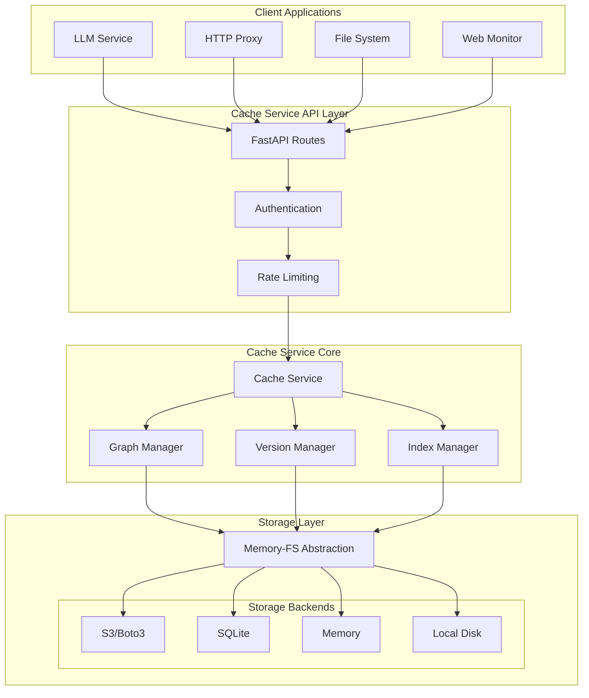

## 2. G3 Storage Structure

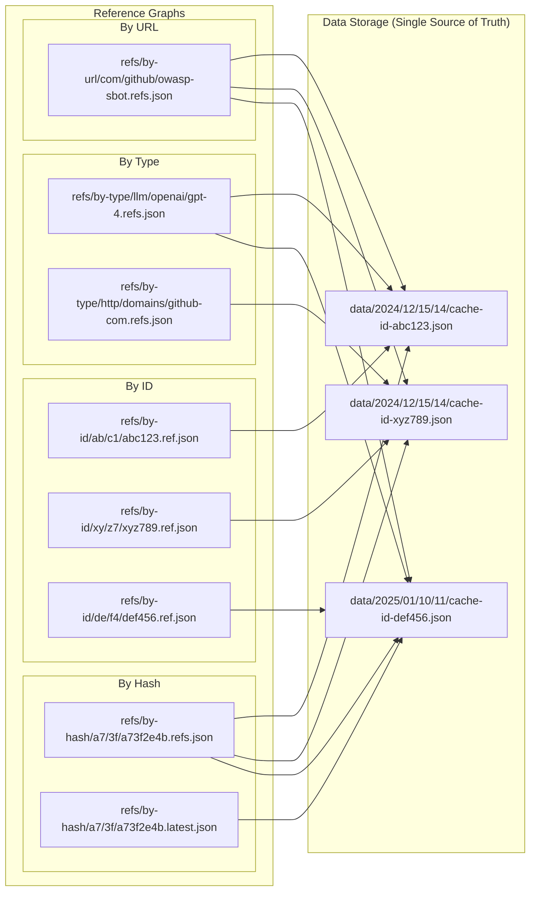

## 3. Read Operation Flow

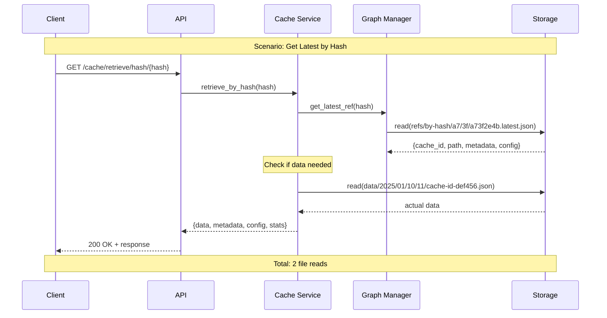

## 4. Write Operation Flow

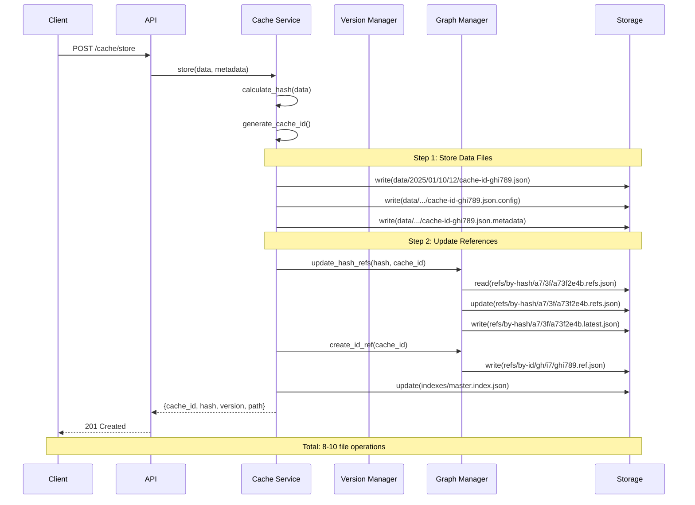

## 5. API Route Hierarchy

```mermaid
graph TB
    ROOT[/cache]
    
    ROOT --> INFO[/info]
    INFO --> INFO_HEALTH[GET /health]
    INFO --> INFO_STATUS[GET /status]
    INFO --> INFO_SERVER[GET /server]
    INFO --> INFO_VERSIONS[GET /versions]
    
    ROOT --> STORE[/store]
    STORE --> STORE_POST[POST /]
    STORE --> STORE_PUT[PUT /{hash}]
    
    ROOT --> RETRIEVE[/retrieve]
    RETRIEVE --> RET_HASH[/hash/{hash}]
    RET_HASH --> RET_HASH_GET[GET /]
    RET_HASH --> RET_HASH_DATA[GET /data]
    RET_HASH --> RET_HASH_META[GET /metadata]
    RET_HASH --> RET_HASH_CONFIG[GET /config]
    RET_HASH --> RET_HASH_VERSIONS[GET /versions]
    RET_HASH --> RET_HASH_VERSION[GET /v/{version}]
    RETRIEVE --> RET_ID[GET /id/{cache_id}]
    
    ROOT --> EXISTS[/exists]
    EXISTS --> EXISTS_HASH[/hash/{hash}]
    EXISTS_HASH --> EXISTS_HEAD[HEAD /]
    EXISTS_HASH --> EXISTS_GET[GET /]
    EXISTS --> EXISTS_BATCH[POST /batch]
    
    ROOT --> SEARCH[/search]
    SEARCH --> SEARCH_POST[POST /]
    SEARCH --> SEARCH_TAG[GET /by-tag/{tag}]
    SEARCH --> SEARCH_TYPE[GET /by-type/{type}]
    SEARCH --> SEARCH_TEMPORAL[GET /temporal]
    
    ROOT --> BATCH[/batch]
    BATCH --> BATCH_STORE[POST /store]
    BATCH --> BATCH_RETRIEVE[POST /retrieve]
    BATCH --> BATCH_DELETE[POST /delete]
```

## 6. Version Management System

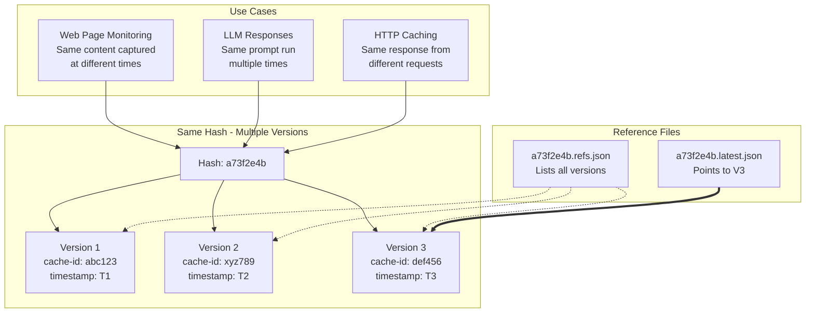

## 7. Sharding Strategy

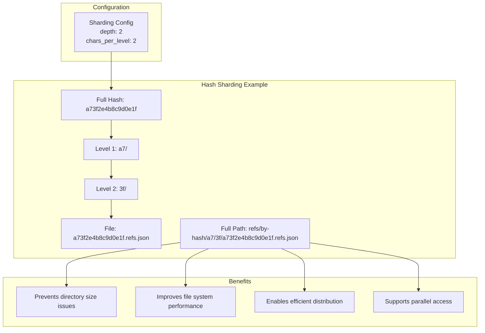

## 8. Performance Optimization Flow

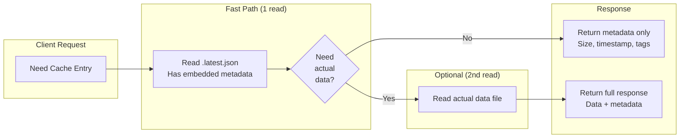

## 9. Storage Backend Architecture

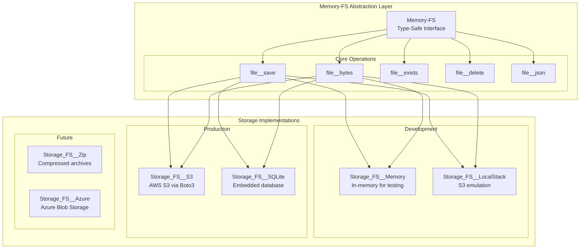

## 10. Data Flow for Different Use Cases

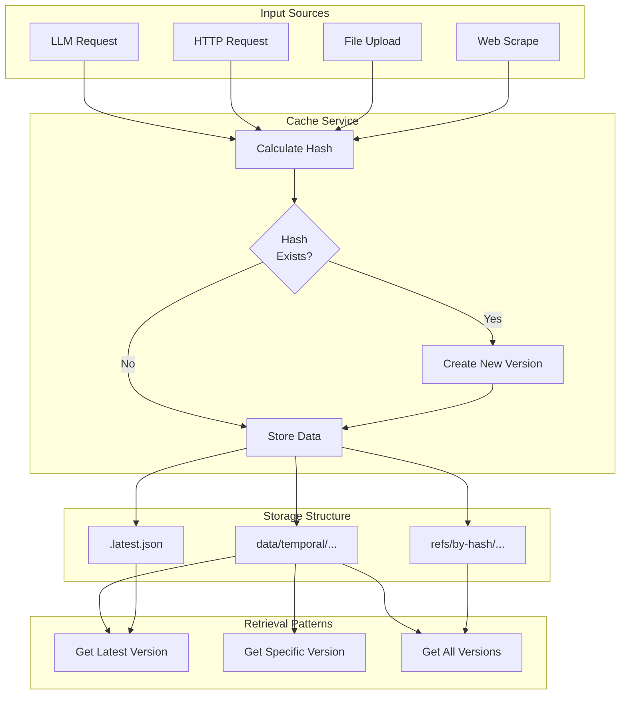

## 11. Request/Response Lifecycle

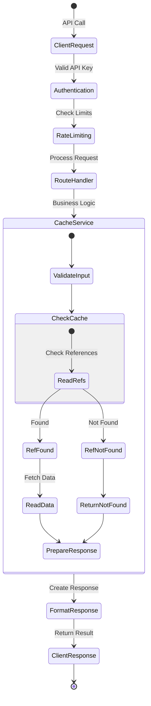

## 12. Cache Entry Lifecycle

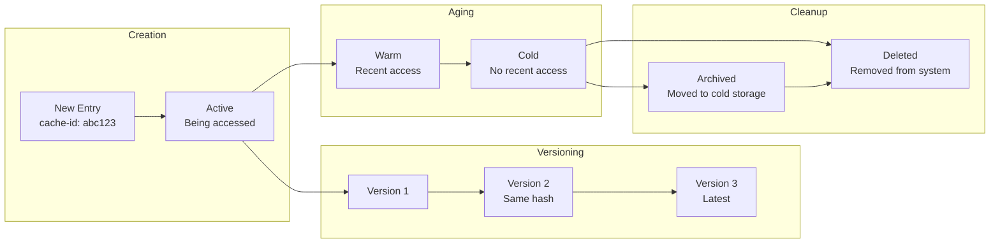

---

## Diagram Descriptions

1. **System Architecture Overview**: High-level view of all components and their interactions
2. **G3 Storage Structure**: Shows the graph-based reference system pointing to single data source
3. **Read Operation Flow**: Sequence diagram of a typical read operation (2 file reads)
4. **Write Operation Flow**: Sequence diagram of a write operation (8-10 file operations)
5. **API Route Hierarchy**: Complete API endpoint structure
6. **Version Management System**: How multiple versions share the same hash
7. **Sharding Strategy**: Hash-based directory sharding for scalability
8. **Performance Optimization Flow**: Decision flow for fast metadata access
9. **Storage Backend Architecture**: Memory-FS abstraction and implementations
10. **Data Flow for Different Use Cases**: How different sources flow through the cache
11. **Request/Response Lifecycle**: State diagram of request processing
12. **Cache Entry Lifecycle**: Timeline of a cache entry from creation to deletion

These diagrams complement the architecture documents and provide visual understanding of the cache service design.